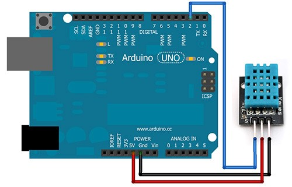
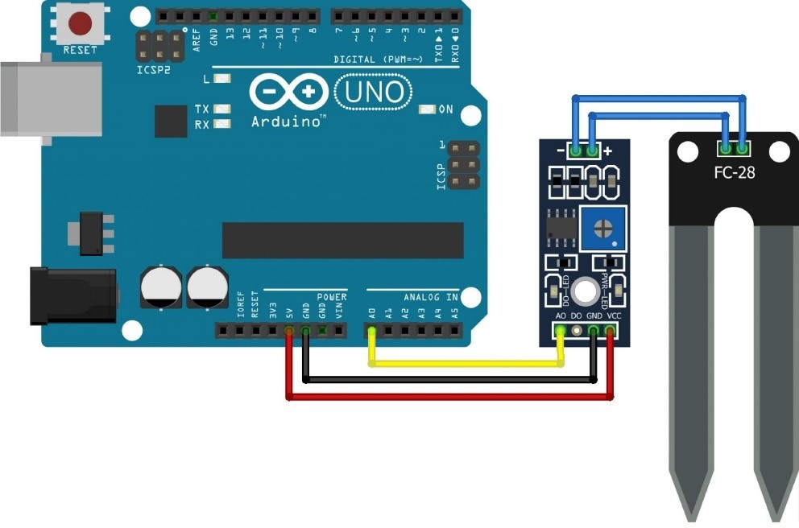
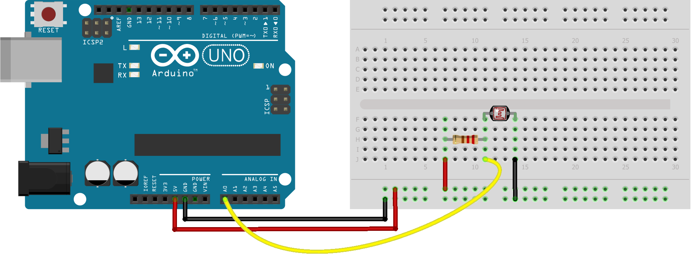
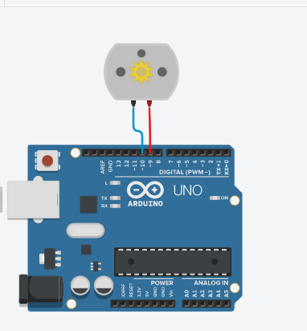
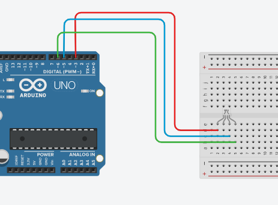

## Arduino con Johnny Five
- Cada proyecto de arduino crea un servidor independiente (archivo main.js)
- El servidor es ejecutado por default(el puerto puede variar) con la siguiente configuración:
```
var clienteServer = require('socket.io-client')('http://localhost:8080');
```
- El puerto de arduino en este caso es el COM3 o COM4 pero esto depende de su configuración local

### PingFirmata

Para usar el sensor de proximidad con johnny-five es necesario grabar PingFirmata(este firmware se encuentra en proximidad/pingFirmata) en el Arduino, en los proyectos distintos a este usar StandardFirmata

##Diagramas
###Sensor de humedad DTH11


###Sensor de humedad YL-69


###Sensor de luz


###Motor DC


###Led RGB


###Sensor de velocidad RPM LM393

