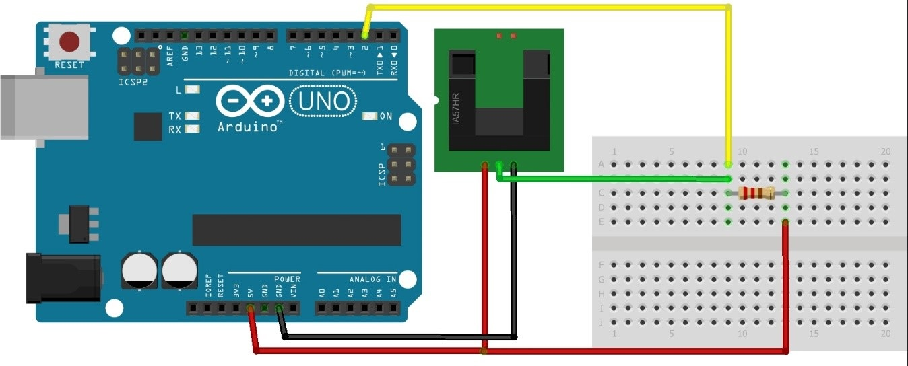

## Arduino con Johnny Five
- Cada proyecto de arduino crea un servidor independiente (archivo main.js)
- El servidor es ejecutado por default(el puerto puede variar) con la siguiente configuración:
```
var clienteServer = require('socket.io-client')('http://localhost:8080');
```
- El puerto de arduino en este caso es el COM3 o COM4 pero esto depende de su configuración local

### PingFirmata

Para usar el sensor de proximidad con johnny-five es necesario grabar PingFirmata(este firmware se encuentra en proximidad/pingFirmata) en el Arduino, en los proyectos distintos a este usar StandardFirmata

## Diagramas
### Sensor de humedad DHT11
- En este caso se usan dos arduinos si se quiere implementar johnny-five, en la ruta DHT11/sketch/sketch_nov25a/ se encuentra el sketch que debe ser cargado en el arduino que se comunicará con el sensor y que a su ves este se comunicará con un arduino padre para establecer la comunicación usando johnny-five
- Ejemplo: http://johnny-five.io/examples/multi-DHT11_I2C_NANO_BACKPACK/

### Sensor de humedad YL-69


### Sensor de luz


### Motor DC


### Led RGB


### Sensor de velocidad RPM LM393

